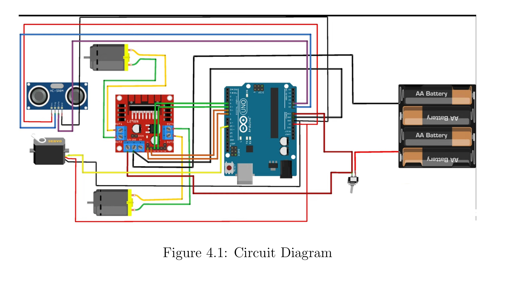

# Obstacle Avoidance Robot 🚴✨

[](https://www.arduino.cc/) [](LICENSE)

An Arduino-powered autonomous robot that uses an ultrasonic sensor mounted on a servo motor to detect and avoid obstacles in real time.

---

## 🧠 Introduction

This project is a simple obstacle-avoiding robot using:

* Arduino Uno as the main controller
* HC-SR04 ultrasonic sensor mounted on a servo motor for directional scanning
* L298N motor driver to control two DC motors

The robot autonomously scans for obstacles and intelligently chooses the safest path by turning away from nearby objects.

---

## ✨ Features

* Real-time obstacle detection
* Directional scanning using servo
* Smart path selection based on left/right distance
* Easy to assemble and modify
* Beginner-friendly code and documentation

---

## 🔧 Hardware Requirements

* Arduino Uno board
* L298N Motor Driver Shield
* 2× DC Motors with wheels
* 1× HC-SR04 Ultrasonic Sensor
* 1× Servo Motor (SG90 or similar)
* AA Battery Pack with Switch
* Jumper Wires and Chassis

---

## 💻 Software Requirements

* Arduino IDE (v1.8 or newer)
* Built-in Servo library (pre-installed with Arduino IDE)

---

## 📊 Circuit Diagram



---

## ⚙️ Wiring Guide

| Component        | Arduino Pin | Description               |
| ---------------- | ----------- | ------------------------- |
| Motor Driver IN1 | D3          | Right motor control       |
| Motor Driver IN2 | D2          | Right motor control       |
| Motor Driver IN3 | D7          | Left motor control        |
| Motor Driver IN4 | D4          | Left motor control        |
| Motor Driver ENA | D5 (PWM)    | Right motor speed control |
| Motor Driver ENB | D6 (PWM)    | Left motor speed control  |
| Servo Motor      | D11         | Controls ultrasonic sweep |
| Ultrasonic TRIG  | A4          | Trigger pin for sensor    |
| Ultrasonic ECHO  | A5          | Echo pin for sensor       |

---

## 🚀 Installation

1. **Clone the Repository**

   ```bash
   git clone https://github.com/<your-username>/arduino-obstacle-avoiding-robot.git
   cd arduino-obstacle-avoiding-robot
   ```

2. **Launch Arduino IDE**

3. **Open `Project_Code.ino`**

4. **Select Board and Port**

   * Board: Arduino Uno
   * Port: COMx (your USB port)

5. **Upload Code**

   * Click the Upload ▶️ button in the IDE

---

## 🕹️ Usage

* Power on the robot using the switch.
* Place it in an open area with potential obstacles.
* Watch it navigate and avoid objects automatically.

---

## 🧱 Code Structure

```cpp
loop() {
  read center distance;
  if (clear) move forward;
  else scan left and right;
  compare distances;
  turn toward the clearer direction;
}
```

---

## 📂 Project Structure

```
/
├── Documentation.pdf          # Full report and technical breakdown
├── Presentation.pdf           # Project slides for presentation
├── Project_Code.ino           # Arduino source code
├── diagram.png                # Full circuit diagram
└── README.md                  # Project overview (this file)
```

---

## 🔗 References

* [Arduino Guide](https://www.arduino.cc/en/Guide/Introduction)
* [HC-SR04 Datasheet](https://cdn.sparkfun.com/datasheets/Sensors/Proximity/HCSR04.pdf)
* [L298N Motor Driver Tutorial](https://lastminuteengineers.com/l298n-dc-motor-driver-arduino-tutorial/)
* [Project Inspiration - Arafamicrosystems](https://www.youtube.com/arafamicrosystems)
